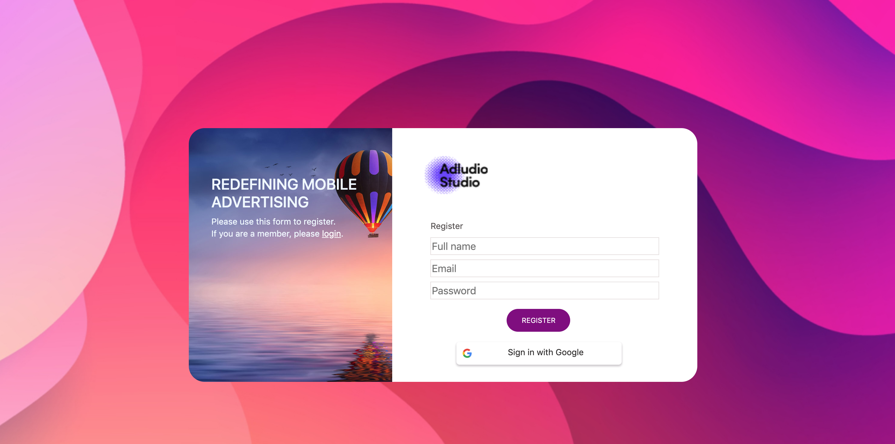

## Adludio - Task 1
Please try to build the login.png screen using FE technologies that you're familiar with. 

## Original

## My version

### How to run

### `npm install`
To install dependancies

### `yarn start`

Runs the app in the development mode. 
Open [http://localhost:3000](http://localhost:3000) to view it in the browser.

The page will reload if you make edits. 
You will also see any lint errors in the console.

